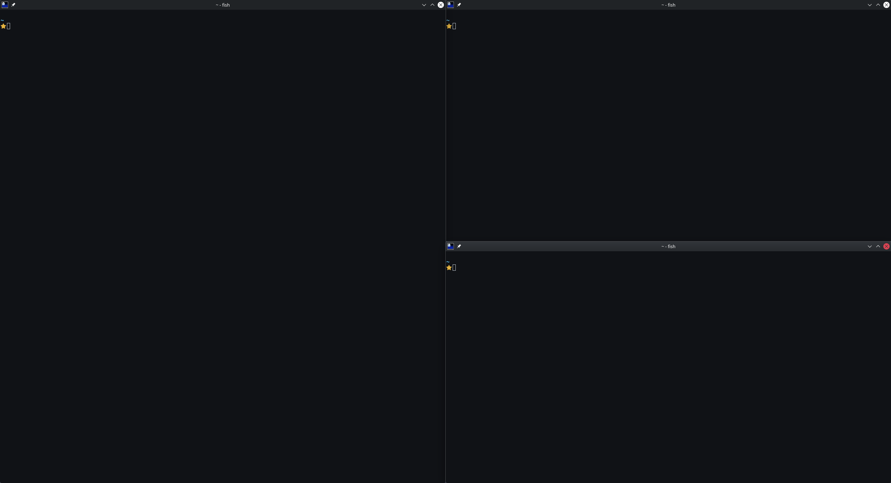
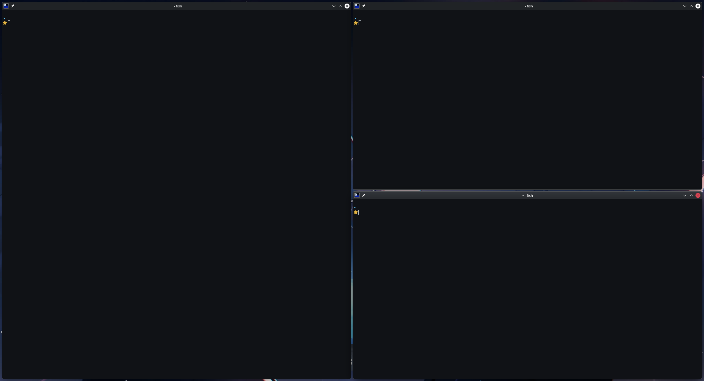
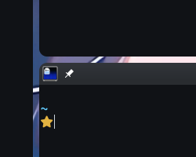
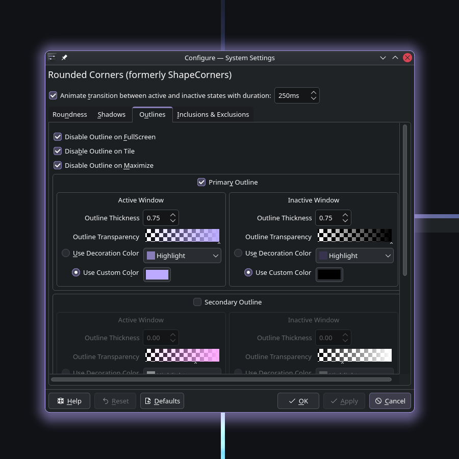
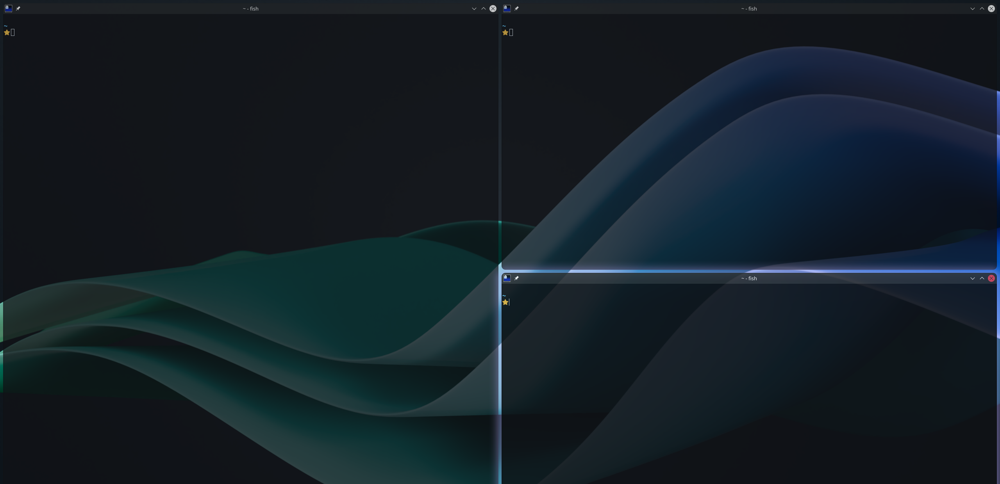
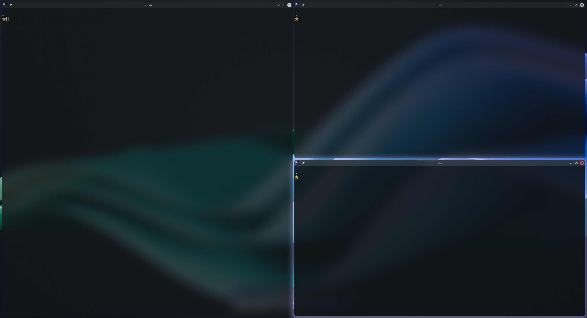
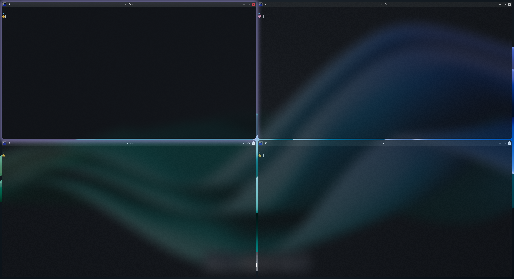
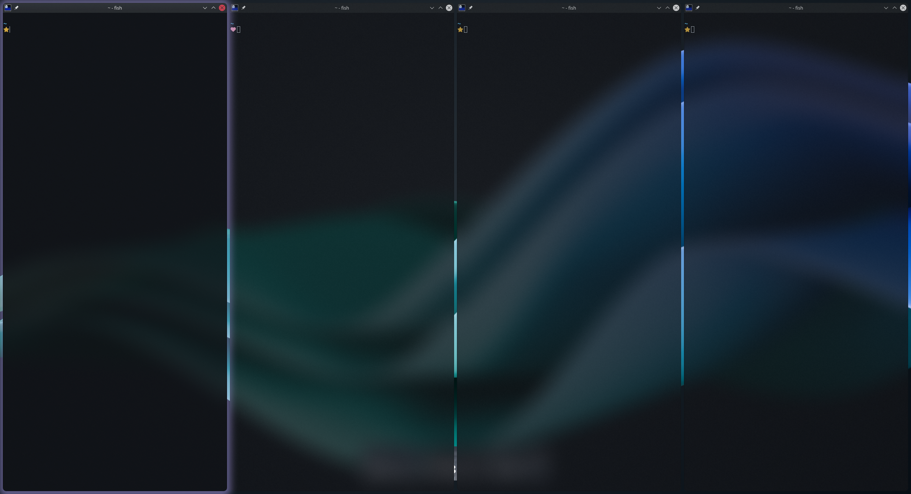

# How I set up my KDE to use tiling

One of the things I enjoy the most is using my computers without touching the mouse. I become much more productive from not having to context switch and I save so much time and effort by not having to physically take my hands off the keyboard to use the mouse or trackpad.

Tools like tiling window managers such as Hyprland really clicked with me and my usage. However, just using a minimal barebones tiling window manager without a desktop environment can be really annoying, especially in a work setting.

> Plugging in laptop into a monitor for it to not auto detect, connecting a USB stick and not getting a prompt to mount, etc.

These can all be solved with custom shell scripts and some tinkering. But these solutions can be hacky and janky. When I connect my laptop to a monitor before I need to present something in a meeting, I just need it to work.

This is why I decided to settle on KDE. It already has all the functionality I need for work and personal use. I just need to get the tiling functionality I love so much from tiling window managers to work on KDE.

To achieve this, I used a KWin Script called `Krohnkite` and tweaked other KDE settings.

## My workflow

This is my workflow with tiling:
- I use workspaces (i.e. Virtual Desktops) to organise my windows.
- I generally use a maximum of four windows per workspace.
- I move them around using keyboard shortcuts and rarely use my mouse.

## My setup (at the time of this write-up)

- KDE Plasma 6.6.5 with Wayland
- CachyOS

 I used the AUR to install some packages mentioned below. Alternatives include installing from other package managers or building from source.

## 📦 Installation

For the tiling functionality on KDE, I use [Krohnkite](https://github.com/esjeon/krohnkite).

> In some older versions of KDE (e.g. 5.x something), tiling seems to be an option available in the System Settings so it's worth checking whether you already have it or not.

- `System Settings` -> `Window Management` -> `KWin Scripts`
- `Get New...` -> search for `Krohnkite` and install.
- Enable it and hit `Apply`. Existing windows may not get updated but newer ones will.

## 🎨 Appearance Configuration

### Gaps

The first issue I had with the default settings is that there are no gaps between the edges of the screen and between windows. Luckily, this can be changed in Krohnkite settings.

- `System Settings` -> `Window Management` -> `KWin Scripts`
- `Krohnkite` -> `Configure...` -> `Geometry` -> Set all `Default Gaps` to 8px

### Rounded Corners (+ Glow and Borders)

I added some softness to the windows by rounding out their corners using [Rounded Corners](https://github.com/matinlotfali/KDE-Rounded-Corners).

- `System Settings` -> `Window Management` -> `Desktop Effects`
- `Rounded Corners` -> `Configure...`

**Roundness tab**

| Parameter                       | Value |
| ------------------------------- | ----- |
| Active Window                   | 10    |
| Inactive Window                 | 10    |
| Disable Roundness on Tile       | False |
| Disable Roundness on Maximise   | False |
| Disable Roundness on FullScreen | True  |

**Shadows tab**

Shadows can become glows or shadows depending on the colour. 

| Parameter                  | Value   |
| -------------------------- | ------- |
| (Active) Shadow Size       | 60      |
| (Active) Use Custom Colour | #bbaaff |
| (Active) Shadow Size       | 30      |
| (Active) Use Custom Colour | #000000 |

**Outlines tab**

| Parameter                    | Value   |
| ---------------------------- | ------- |
| Primary Outline              | True    |
| (Active) Outline Thickness   | 2.00    |
| (Active) Use Custom Colour   | #bbaaff |
| (Inactive) Outline Thickness | 0.00    |

### Transparency

In order to know which window I'm currently on at the moment at a glance, I rely on visual queues. The first queue is transparency. The active window will be more opaque compared to inactive ones.

> The easiest way to set transparency is under `Window Management` -> `Desktop Effects` -> `Translucency`. However, it doesn't seem to have the option to set the opacity of active windows so I decided to go with `Window Rules` instead.

- `System Settings` -> `Window Management` -> `Window Rules`
- `Add New...` -> Enter the following parameters (`+ Add Property...` for opacity parameters)

| Parameter                  | Value            |
| -------------------------- | ---------------- |
| Window class (application) | Unimportant      |
| Match whole window class   | No               |
| Window types               | All window types |
| Active opacity             | Force, 90%       |
| Inactive opacity           | Force, 75%       |

### Blur

Transparency is nice but can negatively affect readability. This is why I decided to add blur to transparent windows.

> Again, the easiest way to set blur is under `Window Management` -> `Desktop Effects` -> `Blur`. However, for some reason it doesn't work so I switched to `Better Blur DX`. (`Blur` worked for me in the past so I'm not sure what happened)

- Install `kwin-effects-better-blur-dx` from the AUR, etc.
- `System Settings` -> `Window Management` -> `Desktop Effects`
- Enable `Better Blur DX` -> `Configure` -> Enter the following parameters

**General tab**

| Parameter                 | Value |
| ------------------------- | ----- |
| Blur strength             | 8     |
| Noise strength            | 20    |
| Brightness                | 100%  |
| Saturation                | 100%  |
| Contrast                  | 100%  |
| Force Contrast Parameters | Off   |
| Corner Radius             | 10.00 |

> Match `Corner Radius` with the values you used for the Rounded Corners effect.

**Force blur tab**

| Parameter                        | Value       |
| -------------------------------- | ----------- |
| Classes of windows to force blur | Leave empty |
| Blur all except matching         | True        |
| Blur window decorations as well  | True        |
| Blur menus                       | True        |
| Blur docks                       | True        |

## 🛠️ Functionality Configuration

### Layouts

Krohnkite offers many layout options. For my use case:
- I usually don't open more than four windows per workspace
- By default I like to split the screen into four corners: top left, top right, bottom left and bottom right
- When I'm on my ultra-wide monitor, I like to split the windows vertically into columns

I opted for the Quarter and Columns layouts, and can switch between them on the fly with keybinds.

The Quarter layout splits the windows into each corner of the monitor

The Columns layout splits the windows to vertical columns. I especially like this on an ultra-wide monitor.

> I also noticed that there is another layout called Binary Tree which works similarly to Quarter but also works with more than four windows. However, the windows cannot be resized so that is a dealbreaker for me.

Set layouts by going into Krohnkite settings. 

- `System Settings` -> `Window Management` -> `KWin Scripts`
- `Krohnkite` -> `Configure...` -> `Layouts` -> Set all unused layouts' orders to 0 and your used layouts' order from 1 onwards in order (e.g. Quarter on 1 and Columns on 2)

### Keybinds

- `System Settings` -> `Keyboard` -> `Shorcuts`

| Functionality             | Keybind       | Explanation                                                                                                                                                                                                                                                          |
| ------------------------- | ------------- | -------------------------------------------------------------------------------------------------------------------------------------------------------------------------------------------------------------------------------------------------------------------- |
| Close Window              | Alt+Q, Alt+F4 |                                                                                                                                                                                                                                                                      |
| Maximise Window           | Alt+F         |                                                                                                                                                                                                                                                                      |
| Krohnkite: Focus Next     | Alt+J         | Focus window. Acts like a quick "Alt+Tab". I used to have vim-like directional keybinds with Alt+HJKL but honestly it's too much thinking. I'm only using four windows tops per workspace anyway so I'll just spam this one keybind until I get to the window I want |
| Krohnkite: Move Left      | Alt+Shift+H   | Move window around within the workspace. I want exact control of where my windows go so I opted for HJKL for directions                                                                                                                                              |
| Krohnkite: Move Down/Next | Alt+Shift+J   |                                                                                                                                                                                                                                                                      |
| Krohnkite: Move Up/Prev   | Alt+Shift+K   |                                                                                                                                                                                                                                                                      |
| Krohnkite: Move Right     | Alt+Shift+L   |                                                                                                                                                                                                                                                                      |
| Krohnkite: Shrink Width   | Alt+Y         | Resize windows. Using Alt+YUIO which is a row above HJKL                                                                                                                                                                                                             |
| Krohnkite: Grow Height    | Alt+U         |                                                                                                                                                                                                                                                                      |
| Krohnkite: Shrink Height  | Alt+I         |                                                                                                                                                                                                                                                                      |
| Krohnkite: Grow Width     | Alt+O         |                                                                                                                                                                                                                                                                      |
| Switch to Desktop 1       | Alt+1         | Switch to workspace. Repeat unti Alt+6                                                                                                                                                                                                                               |
| Window to Desktop 1       | Alt+Shift+1   | Move window to workspace. Repeat until  Alt+Shift+6                                                                                                                                                                                                                  |
| Krohnkite: Next Layout    | Alt+/         | Switch between layouts                                                                                                                                                                                                                                               |

> I opted to keep showing window titles so that windows can be dragged and dropped using the mouse, in addition to the aforementioned keybinds.